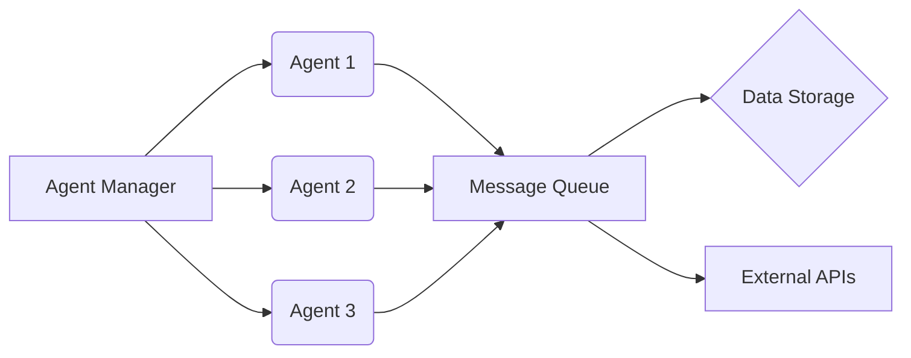
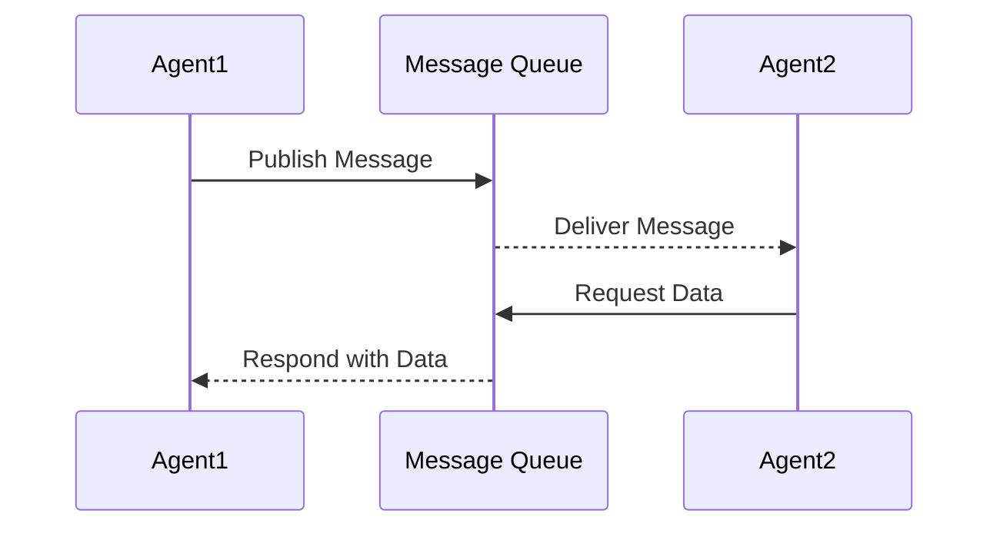

# Project Diagrams

This file contains diagrams of the project architecture, agent communication patterns, and other relevant system designs, using Mermaid syntax.

## Architecture Diagram

## Agent Communication Diagram

<!-- Add more diagrams below as needed -->