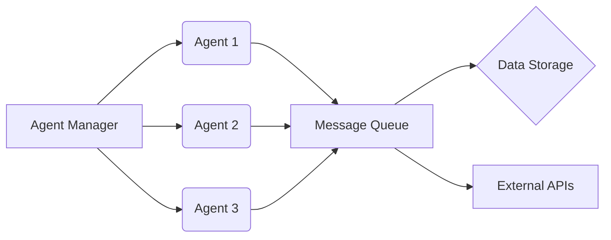
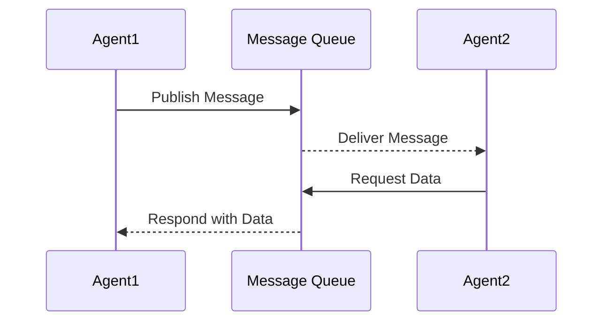
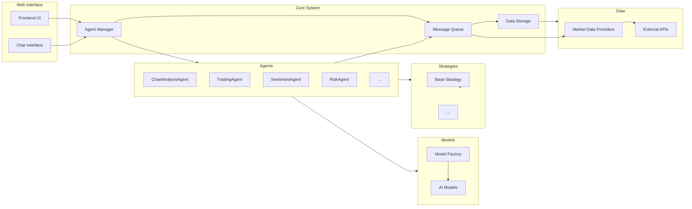

# Project Diagrams

This file contains diagrams of the project architecture, agent communication patterns, and other relevant system designs, using Mermaid syntax.

## Architecture Diagram



## Agent Communication Diagram



## Component Diagram



## Deployment Diagram

```mermaid
graph LR
    User[User] -- Uses --> LocalMachine[Local Machine]
    LocalMachine -- Runs --> System[afz1 System]
    System -- Accesses Data from --> ExternalAPIs[External APIs (e.g., Binance, Etherscan)]

    subgraph Cloud Deployment
        CloudServer[Cloud Server] -- Runs --> CloudSystem[afz1 System (Cloud)]
        CloudSystem -- Accesses Data from --> ExternalAPIs
        User -- Accesses --> CloudSystem
    end

    LocalMachine -- Optionally Deploys to --> CloudServer
```

## Data Flow Diagram

```mermaid
graph LR
    ExternalDataSources[External Data Sources (e.g., Binance API, Etherscan API)] --> MarketDataProviders[Market Data Providers]
    MarketDataProviders --> MessageQueue[Message Queue]
    MessageQueue --> Agents[Trading Agents]
    Agents --> SignalGenerator[Signal Generator]
    SignalGenerator --> OrderExecution[Order Execution Module]
    OrderExecution --> ExchangeAPI[Exchange API]
    Agents --> DataStorage[Data Storage]
    DataStorage --> UserInterface[User Interface (Web/CLI)]
    Agents --> UserInterface
    UserInterface -- Receives Feedback from --> User

    style MessageQueue fill:#f9f,stroke:#333,stroke-width:2px
    style Agents fill:#ccf,stroke:#333,stroke-width:2px
    style DataStorage fill:#cfc,stroke:#333,stroke-width:2px
    style UserInterface fill:#fcc,stroke:#333,stroke-width:2px
```

<!-- Add more diagrams below as needed -->